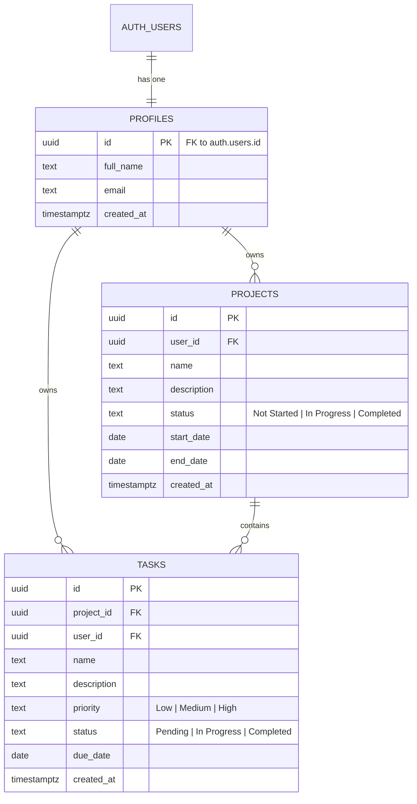

# GitPub: Project & Task Management (Web + Android)

GitPub lets a user create projects, organise tasks inside them, track progress, and see overall statistics on a dashboard. A **React web app** and a **Flutter Android app** both talk to **one Node.js/Express REST API**, which stores everything in **Supabase (PostgreSQL + Auth)**. Register on one platform, log in on the other, and you see the same data.

Built for the *Full Stack Developer (Web + Mobile)* intern assessment.

| Item | Where |
|---|---|
| Web app (Vercel) | `<your-web-url>.vercel.app` |
| Backend API (Vercel) | `https://backend-omega-jade-33.vercel.app` (default in the mobile app) |
| Android APK | Download button on the web login page (`VITE_APK_DOWNLOAD_URL`) |
| Health check | `GET /api/health` |

---

## Table of Contents

1. [Features](#1-features)
2. [Architecture](#2-architecture)
3. [Tech Stack](#3-tech-stack)
4. [Repository Structure](#4-repository-structure)
5. [Database Design](#5-database-design)
6. [Security Model](#6-security-model)
7. [Setup Guide](#7-setup-guide)
8. [Environment Variables](#8-environment-variables)
9. [API Documentation](#9-api-documentation)
10. [Web App Guide](#10-web-app-guide)
11. [Mobile App Guide](#11-mobile-app-guide)
12. [Deployment](#12-deployment)
13. [5-Minute Demo Script](#13-5-minute-demo-script)
14. [Assessment Requirement Coverage](#14-assessment-requirement-coverage)
15. [Design Decisions & Known Limitations](#15-design-decisions--known-limitations)
16. [Troubleshooting](#16-troubleshooting)

---

## 1. Features

- **Authentication**: register, log in, log out, delete account. One account works on web and mobile.
- **Projects**: create, view, edit, delete. Fields: name, description, status (`Not Started` / `In Progress` / `Completed`), start date, end date, created date.
- **Tasks**: create, view, edit, delete, mark complete. Fields: name, description, priority (`Low` / `Medium` / `High`), status (`Pending` / `In Progress` / `Completed`), due date, created date.
- **Dashboard**: total projects, total tasks, completed tasks, pending tasks, projects in progress, all scoped to the logged-in user.
- **Search & filters**: search projects and tasks by name; filter projects by status; filter tasks by status and priority.
- **Cross-platform sync**: a change on one platform shows on the other after a refresh (pull-to-refresh on mobile).
- **Session handling**: on token expiry, both apps return to the login screen with *"Session expired. Please log in again."*
- **Mobile extras**: JWT kept in Android Keystore-backed secure storage, network-failure snackbar, and an in-app "Server API URL" setting to point the app at any backend.

---

## 2. Architecture

```
┌──────────────────┐        ┌──────────────────────┐
│  React web (Vite)│        │ Flutter Android app  │
│  localStorage JWT│        │ Secure-storage JWT   │
└────────┬─────────┘        └──────────┬───────────┘
         │      HTTPS + Bearer JWT     │
         └──────────────┬──────────────┘
                        ▼
          ┌──────────────────────────────┐
          │  Express REST API (Vercel)   │
          │  • rate limit (auth routes)  │
          │  • JWT verify (JWKS / jose)  │
          │  • validation + ownership    │
          └──────────────┬───────────────┘
                         ▼
          ┌──────────────────────────────┐
          │ Supabase                     │
          │  • Auth (bcrypt, JWT ES256)  │
          │  • PostgreSQL + RLS          │
          └──────────────────────────────┘
```

There is **no separate mobile backend**. Both clients call the same endpoints.

**Auth flow:** the API proxies `register`/`login` to Supabase Auth and returns Supabase's access token (a JWT). Clients send it as `Authorization: Bearer <token>`. The API verifies it against Supabase's public JWKS endpoint using `jose`; if local verification fails it falls back to `supabase.auth.getUser(token)`.

---

## 3. Tech Stack

| Layer | Technology |
|---|---|
| Web | React 18, Vite 6, JavaScript, plain CSS (responsive breakpoint at 768px) |
| API | Node.js, Express 4, `cors`, `express-rate-limit`, `jose`, `dotenv`, `@supabase/supabase-js` |
| Mobile | Flutter (Dart ≥ 3.0), Material 3 dark theme, `http`, `flutter_secure_storage` |
| Database / Auth | Supabase PostgreSQL with Row Level Security; Supabase Auth |
| Hosting | Vercel (API and web), APK for Android |

---

## 4. Repository Structure

```
.
├── README.md
└── GitPub/
    ├── backend/
    │   ├── api/index.js        # Vercel serverless entry: re-exports the Express app
    │   ├── server.js           # Whole API: middleware, auth, projects, tasks, dashboard
    │   ├── vercel.json         # Rewrites every route to /api/index.js
    │   └── package.json
    ├── web/
    │   ├── src/
    │   │   ├── App.jsx         # All views: auth, dashboard, projects, project details, tasks, modals
    │   │   ├── main.jsx
    │   │   └── style.css
    │   ├── index.html
    │   ├── vercel.json         # SPA rewrite to /index.html
    │   ├── vite.config.js
    │   └── package.json
    ├── mobile/
    │   ├── lib/main.dart       # All screens, API client, secure storage
    │   └── pubspec.yaml
    └── database/
        └── schema.sql          # Tables, indexes, RLS policies, signup trigger
```

> All commands below assume you start at the repository root.

---

## 5. Database Design

### ER diagram



### Design notes

- **Normalised, three tables.** Credentials live only in `auth.users` (managed by Supabase). `profiles` holds public metadata, `projects` belongs to a profile, and `tasks` belongs to a project.
- **Foreign keys with `ON DELETE CASCADE`.** Deleting a user removes their profile, projects and tasks; deleting a project removes its tasks.
- **`CHECK` constraints** enforce the allowed values for `status` and `priority` at the database level.
- **Indexes** on `projects(user_id, status)` and `tasks(user_id, project_id, status, priority)` support the filters used by the API.
- **Signup trigger:** `handle_new_user()` (`SECURITY DEFINER`) on `auth.users` inserts or updates the matching `profiles` row, reading `full_name` from signup metadata. The API also upserts the profile as a safety net.
- `tasks.user_id` is stored alongside `project_id` so ownership checks and dashboard counts need no join.

---

## 6. Security Model

| Requirement | How it is handled |
|---|---|
| Passwords never stored in plain text | Delegated to Supabase Auth, which stores salted bcrypt hashes. The API never persists passwords. |
| Unique emails | Enforced by Supabase Auth. |
| JWT authentication | Supabase access token (ES256), verified with the project's JWKS via `jose`, with an Auth API fallback. |
| Protected routes | `authenticateToken` middleware on every route except `register`, `login`, `logout` and `health`. |
| Authorization (own data only) | Every query filters by `user_id = req.user.id`. Task creation first checks the target project belongs to the caller. Cross-user access returns `404`. |
| Defence in depth | RLS is enabled on all tables with `auth.uid() = user_id` policies. Note the API uses the service-role key, which **bypasses RLS**, so the API-level `user_id` filter is the primary guard and RLS protects any direct client access. |
| SQL injection | No raw SQL. All reads and writes go through the Supabase client (PostgREST, parameterised). `ilike` search values are passed as bound values. |
| Input validation | Required fields, string type checks, trimmed values, email and password length checks, enum validation for status and priority. Invalid input returns `400` with a clear message. |
| Rate limiting | `express-rate-limit` on `/api/auth/register` and `/api/auth/login`: 50 requests per 15 minutes per IP. |
| No sensitive data in responses | Responses never include passwords or hashes; user objects contain only `id`, `email`, `fullName`. |
| Secure token storage (mobile) | `flutter_secure_storage` (Android Keystore-backed). |
| Error handling | JSON `{ "error": "..." }` responses, a `404` catch-all, and a global error handler that hides internals. |

> Never commit `SUPABASE_SECRET_KEY`. It is a service-role key with full database access and belongs only in the backend's environment.

---

## 7. Setup Guide

### Prerequisites

- Node.js 18+ and npm
- A free [Supabase](https://supabase.com) project
- Flutter SDK (stable, Dart ≥ 3.0), Android Studio or the Android SDK, and an emulator or device (mobile only)

### 7.1 Database (Supabase)

1. Create a Supabase project.
2. Open **SQL Editor → New query**, paste the whole of `GitPub/database/schema.sql`, and click **Run**. The script is idempotent and safe to re-run.
3. Go to **Project Settings → API** and note the **Project URL**, the **anon/publishable key**, and the **service_role/secret key**.
4. *(Recommended for demos)* Under **Authentication → Providers → Email**, turn **Confirm email** off so registration returns a token immediately. If it stays on, registration returns `emailConfirmationRequired: true` and the user must verify their email before logging in.

### 7.2 Backend

```bash
cd GitPub/backend
npm install
# create .env (see section 8)
npm run dev        # http://localhost:5000
```

Check it: `curl http://localhost:5000/api/health` → `{"status":"ok","service":"GitPub API"}`

### 7.3 Web

```bash
cd GitPub/web
npm install
echo "VITE_API_URL=http://localhost:5000" > .env
npm run dev        # http://localhost:5173
```

Build for production with `npm run build` (output in `dist/`).

### 7.4 Mobile (Android)

The repository holds the Dart source and `pubspec.yaml`. If the `android/` platform folder is not present in your checkout, generate it once:

```bash
cd GitPub/mobile
flutter create --platforms=android .   # adds android/ without touching lib/ or pubspec.yaml
flutter pub get
```

Then add the internet permission to `android/app/src/main/AndroidManifest.xml`, just inside `<manifest>` (release builds need it):

```xml
<uses-permission android:name="android.permission.INTERNET" />
```

Run it:

```bash
# Android emulator -> API on your computer (10.0.2.2 is the emulator's alias for localhost)
flutter run --dart-define=API_URL=http://10.0.2.2:5000

# Any device -> deployed API
flutter run --dart-define=API_URL=https://<your-backend>.vercel.app

# No flag: uses the default production URL baked into main.dart
flutter run
```

**Pointing the app at a different backend without rebuilding:** on the login or register screen, tap the **Server: …** button, enter the base URL, and save. It is stored in secure storage and used for all later requests.

> A physical phone cannot reach `localhost`. Use your computer's LAN IP (for example `http://192.168.1.20:5000`) or the deployed URL.

### 7.5 Build the APK

```bash
cd GitPub/mobile
flutter build apk --release --dart-define=API_URL=https://<your-backend>.vercel.app
# Output: build/app/outputs/flutter-apk/app-release.apk
```

Host the APK (for example on Google Drive) and set `VITE_APK_DOWNLOAD_URL` on the web app so the login page shows a **Download Android APK** button.

---

## 8. Environment Variables

### Backend: `GitPub/backend/.env`

| Variable | Required | Description |
|---|---|---|
| `PORT` | No | Local port. Default `5000`. |
| `SUPABASE_URL` | Yes | `https://<project-ref>.supabase.co` |
| `SUPABASE_SECRET_KEY` | Yes | Service-role key. Used for all database operations. Keep private. |
| `SUPABASE_PUBLISHABLE_KEY` | Fallback | Anon key. Used only if the secret key is missing (RLS will then block most queries). |
| `SUPABASE_JWKS_URL` | No | Defaults to `<SUPABASE_URL>/auth/v1/.well-known/jwks.json`. |

```env
PORT=5000
SUPABASE_URL=https://<project-ref>.supabase.co
SUPABASE_SECRET_KEY=<service-role-key>
SUPABASE_PUBLISHABLE_KEY=<anon-key>
SUPABASE_JWKS_URL=https://<project-ref>.supabase.co/auth/v1/.well-known/jwks.json
```

### Web: `GitPub/web/.env`

| Variable | Required | Description |
|---|---|---|
| `VITE_API_URL` | Yes (production) | Backend base URL. Defaults to `http://localhost:5000`. |
| `VITE_APK_DOWNLOAD_URL` | No | Link for the "Download Android APK" button on the login page. |

### Mobile: build-time flag

| Flag | Description |
|---|---|
| `--dart-define=API_URL=<url>` | Backend base URL. Without it, the app uses the production default (or `http://localhost:5000` when run on Flutter web). |

---

## 9. API Documentation

**Base URL:** `http://localhost:5000` locally, or your Vercel backend URL.
**Content type:** `application/json`
**Auth:** protected routes need `Authorization: Bearer <access_token>`.
**Errors:** always `{ "error": "message" }`.

### Status codes

| Code | Meaning |
|---|---|
| `200` / `201` | Success / created |
| `400` | Validation failed |
| `401` | Missing, invalid or expired token; bad login credentials |
| `404` | Resource not found, or not owned by the caller; unknown route |
| `429` | Auth rate limit exceeded |
| `500` | Server or database error |

### Endpoint summary

| Method | Path | Auth | Purpose |
|---|---|---|---|
| GET | `/api/health` | No | Service check |
| POST | `/api/auth/register` | No (rate-limited) | Create account |
| POST | `/api/auth/login` | No (rate-limited) | Log in, receive token |
| POST | `/api/auth/logout` | No | Acknowledge logout (stateless) |
| GET | `/api/auth/me` | Yes | Current user |
| DELETE | `/api/auth/account` | Yes | Delete account and all data |
| GET | `/api/projects` | Yes | List own projects (`search`, `status`) |
| GET | `/api/projects/:id` | Yes | One project |
| POST | `/api/projects` | Yes | Create project |
| PUT | `/api/projects/:id` | Yes | Update project |
| DELETE | `/api/projects/:id` | Yes | Delete project (cascades to tasks) |
| GET | `/api/tasks` | Yes | List own tasks (`project_id`, `status`, `priority`, `search`) |
| GET | `/api/tasks/:id` | Yes | One task |
| POST | `/api/tasks` | Yes | Create task |
| PUT | `/api/tasks/:id` | Yes | Update task |
| DELETE | `/api/tasks/:id` | Yes | Delete task |
| GET | `/api/dashboard` | Yes | Statistics |

### 9.1 Authentication

#### `POST /api/auth/register`

Validation: `fullName` non-empty string; `email` string containing `@`; `password` string of at least 6 characters.

```json
{ "fullName": "Jane Doe", "email": "jane@example.com", "password": "securepassword123" }
```

`201 Created`, with a session (email confirmation off):

```json
{
  "message": "Registration successful",
  "emailConfirmationRequired": false,
  "token": "eyJhbGciOi...",
  "user": { "id": "e674092b-...", "email": "jane@example.com", "fullName": "Jane Doe" }
}
```

With **Confirm email** on, `token` is `null`, `emailConfirmationRequired` is `true`, and `message` tells the user to verify their email.

#### `POST /api/auth/login`

```json
{ "email": "jane@example.com", "password": "securepassword123" }
```

`200 OK`:

```json
{
  "message": "Login successful",
  "token": "eyJhbGciOi...",
  "user": { "id": "e674092b-...", "email": "jane@example.com", "fullName": "Jane Doe" }
}
```

Bad credentials return `401`.

#### `POST /api/auth/logout`

`200 OK` → `{ "message": "Logged out successfully" }`. Tokens are stateless, so clients discard the token locally.

#### `GET /api/auth/me`

`200 OK` → `{ "user": { "id": "...", "email": "...", "fullName": "..." } }`

#### `DELETE /api/auth/account`

Deletes the caller's tasks, projects, profile and Supabase Auth user. `200 OK` → `{ "message": "Account and all associated data deleted successfully" }`

### 9.2 Projects

**Project object**

```json
{
  "id": "93a65c82-3591-447a-8f83-e8471b0ea100",
  "user_id": "e674092b-8a21-4f1b-a912-16789abcdef0",
  "name": "Mobile Redesign",
  "description": "Revamp mobile UX and theme",
  "status": "In Progress",
  "start_date": "2026-10-01",
  "end_date": "2026-11-01",
  "created_at": "2026-10-06T12:00:00Z"
}
```

| Endpoint | Details |
|---|---|
| `GET /api/projects` | Query: `search` (name substring, case-insensitive), `status` (`Not Started`, `In Progress`, `Completed`; `All` means no filter). Newest first. Returns an array. |
| `POST /api/projects` | Body: `name` (required), `description`, `status` (default `Not Started`), `start_date`, `end_date`. Returns `201` and the project. |
| `GET /api/projects/:id` | Returns the project or `404`. |
| `PUT /api/projects/:id` | Any subset of the editable fields. `name` cannot be empty; `status` must be valid. Returns the updated project. |
| `DELETE /api/projects/:id` | `{ "message": "Project deleted successfully" }` |

### 9.3 Tasks

**Task object**

```json
{
  "id": "27c32bf2-68c1-4b11-9a40-27ebca937a1e",
  "project_id": "93a65c82-3591-447a-8f83-e8471b0ea100",
  "user_id": "e674092b-8a21-4f1b-a912-16789abcdef0",
  "name": "Implement Secure Storage",
  "description": "Use flutter_secure_storage for auth tokens",
  "priority": "High",
  "status": "Pending",
  "due_date": "2026-10-10",
  "created_at": "2026-10-06T12:30:00Z"
}
```

| Endpoint | Details |
|---|---|
| `GET /api/tasks` | Query: `project_id`, `status` (`Pending`, `In Progress`, `Completed`), `priority` (`Low`, `Medium`, `High`), `search` (name substring). `All` disables a filter. Newest first. |
| `POST /api/tasks` | Body: `project_id` (required, must be your project), `name` (required), `description`, `priority` (default `Medium`), `status` (default `Pending`), `due_date`. Returns `201`. |
| `GET /api/tasks/:id` | Returns the task or `404`. |
| `PUT /api/tasks/:id` | Any subset of `name`, `description`, `priority`, `status`, `due_date`. Marking a task complete is `PUT` with `{ "status": "Completed" }`. |
| `DELETE /api/tasks/:id` | `{ "message": "Task deleted successfully" }` |

### 9.4 Dashboard

`GET /api/dashboard` → `200 OK`

```json
{
  "totalProjects": 5,
  "totalTasks": 20,
  "completedTasks": 12,
  "pendingTasks": 8,
  "projectsInProgress": 3
}
```

`pendingTasks` counts tasks whose status is exactly `Pending`. Tasks `In Progress` are counted in `totalTasks` only.

### 9.5 Example session

```bash
# Log in
TOKEN=$(curl -s -X POST http://localhost:5000/api/auth/login \
  -H "Content-Type: application/json" \
  -d '{"email":"jane@example.com","password":"securepassword123"}' | jq -r .token)

# Create a project
curl -X POST http://localhost:5000/api/projects \
  -H "Authorization: Bearer $TOKEN" -H "Content-Type: application/json" \
  -d '{"name":"Enterprise Cloud Migration","status":"In Progress"}'

# High-priority pending tasks matching "iam"
curl "http://localhost:5000/api/tasks?priority=High&status=Pending&search=iam" \
  -H "Authorization: Bearer $TOKEN"
```

---

## 10. Web App Guide

Single-page React app. Views are switched with state (no router): **Login / Register → Dashboard → Projects → Project Details → Tasks**.

| Area | Behaviour |
|---|---|
| Auth | Forms with `required`, `type="email"` and `minLength=6` validation; loading text on submit buttons; server errors shown inline; success message after registering when email confirmation is on. |
| Dashboard | Five stat cards, quick links to Projects and Tasks, and a **+ New Project** button. Refreshed whenever you open it and after changes. |
| Projects | Card list with status badges and created date; search box; status filter; create/edit modal (name, description, status, start and end dates); delete with confirmation. |
| Project Details | Project header plus its own task list; add, edit, delete tasks; inline status selector; **Complete** button. |
| Tasks | All tasks across projects with search, status filter and priority filter; create/edit modal with a project dropdown. |
| Feedback | Auto-dismissing success and error banners (4 seconds); empty states ("No projects found", "No tasks found"). |
| Session | Token and user stored in `localStorage` (`gitpub_token`, `gitpub_user`). Any `401` outside the auth routes clears them and shows *"Session expired. Please log in again."* |
| Account | **Delete Account** with a confirmation modal. |
| Login page extra | **Download Android APK** button. |

---

## 11. Mobile App Guide

| Screen | What you can do |
|---|---|
| **Login / Register** | Sign in or create an account; shows validation and server errors; **Server: …** button opens the API URL dialog. |
| **Dashboard** (tab 1) | The five statistics; pull-to-refresh. |
| **Projects** (tab 2) | List, search, filter by status, create a project; open a project for its tasks; pull-to-refresh. |
| **Project Details** | Tasks under that project; add, edit, delete; tap the circle icon to toggle complete; change status and priority; pull-to-refresh. |
| **Tasks** (tab 3) | All tasks with search plus status and priority filters; create (choose project), edit, delete, toggle complete; pull-to-refresh. |
| **Menu** (top right) | Logout, Delete Account. |

**Resilience**

- Token in `flutter_secure_storage` under key `token`.
- On launch, `AuthGate` reads the stored token and routes to the app or the login screen.
- A `401` deletes the token and returns to the login screen with *"Session expired. Please log in again."*
- Network failures show *"Connection failed. Please check your network and API server."* in a snackbar instead of crashing.
- `CircularProgressIndicator` while loading; empty-state messages when lists are empty.

---

## 12. Deployment

Deploy the backend and web app as **two Vercel projects** from the same repository.

### Backend

1. Vercel → **Add New → Project** → import the repository.
2. **Root Directory:** `GitPub/backend`
3. **Environment variables:** `SUPABASE_URL`, `SUPABASE_SECRET_KEY`, `SUPABASE_PUBLISHABLE_KEY`, `SUPABASE_JWKS_URL`.
4. Deploy. `vercel.json` rewrites every path to `api/index.js`, which exports the Express app. The server only calls `listen()` outside Vercel.
5. Verify `https://<backend>.vercel.app/api/health`.

### Web

1. Add another project from the same repository.
2. **Root Directory:** `GitPub/web` (Vite is auto-detected).
3. **Environment variables:** `VITE_API_URL=https://<backend>.vercel.app`, and optionally `VITE_APK_DOWNLOAD_URL`.
4. Deploy. `vercel.json` rewrites all routes to `index.html`.

### Mobile against the deployed backend

Use `--dart-define=API_URL=https://<backend>.vercel.app` when running or building, or set the URL in the app's **Server** dialog (see [7.4](#74-mobile-android)).

---

## 13. 5-Minute Demo Script

1. **Register on web** (`test@gitpub.com`, test data only) and land on the Dashboard; all counters read `0`.
2. **Create a project** "Enterprise Cloud Migration" (`In Progress`). Search for it and apply the status filter.
3. **Add two tasks** in the project: "Audit IAM Roles" (High, Pending) and "Setup VPC Peering" (Medium, Pending). Click **Complete** on the first.
4. **Dashboard** now shows: Projects 1, Tasks 2, Completed 1, Pending 1, In Progress 1.
5. **Open the Android app**, log in with the same account, and see the identical dashboard.
6. **On mobile**, create a task, then edit "Setup VPC Peering" to `Completed`; pull to refresh.
7. **Back on web**, refresh and show the task created on mobile and the status change.
8. **Security checks:** show the filters (status and priority) on mobile, then expire or clear the token to demonstrate the redirect to login with *"Session expired. Please log in again."* Turn on airplane mode to show the network error message.

---

## 14. Assessment Requirement Coverage

| Requirement | Status | Notes |
|---|---|---|
| Registration, login, logout, unique email, hashed passwords | ✅ | Supabase Auth (bcrypt). |
| Same account on web and mobile | ✅ | Same API and Supabase user. |
| Project CRUD and fields | ✅ | Web has full CRUD. Mobile can create, list, search, filter and open projects. |
| Task CRUD, complete, view per project | ✅ | Web and mobile. |
| Dashboard (5 metrics) | ✅ | Per user. |
| Search and filters | ✅ | Projects: name, status. Tasks: name, status, priority. |
| Mobile: secure token storage | ✅ | `flutter_secure_storage`. |
| Mobile: expired token message, no-network message | ✅ | |
| Mobile: pull-to-refresh | ✅ | All list screens. |
| Required REST endpoints | ✅ | All present, plus `/api/auth/account` and `/api/health`. |
| Authorization (own data only) | ✅ | `user_id` filters plus RLS. |
| SQL injection protection | ✅ | Supabase client only. |
| Auth rate limiting | ✅ | 50 per 15 min per IP. |
| Input validation | ⚠️ Partial | Required fields, types, enums validated. Email check is `includes('@')`; dates are not format-validated by the API (Postgres rejects bad dates with a `500`). |
| CORS for the web domain | ⚠️ Partial | `cors()` currently allows all origins. |
| Request logging | ⚠️ Partial | `console` logging for errors and startup only. |
| Component structure (web) | ⚠️ Partial | Everything lives in `App.jsx`. |
| Bonus items (Docker, tests, pagination, CI/CD, refresh tokens, etc.) | ➖ Not included | See below. |

---

## 15. Design Decisions & Known Limitations

**Why these choices**

- **Supabase Auth instead of hand-rolled bcrypt + JWT.** Hashing, email uniqueness, token issuing and expiry are battle-tested, and the same JWT works for both clients.
- **API in front of the database instead of clients talking to Supabase directly.** The assessment requires one REST API for both apps, with validation and ownership checks in one place.
- **Service-role key on the server.** Lets the API run admin operations (account deletion). Because it bypasses RLS, ownership is enforced explicitly in every query.
- **JWKS verification.** Tokens are checked locally against Supabase's public keys, which avoids a network call to Supabase on every request.

**Known limitations / next steps**

- Restrict CORS to the deployed web origin, for example `cors({ origin: process.env.WEB_ORIGIN })`.
- Add request logging (for example `morgan`) and stricter validation (a schema library such as `zod` or `joi`, ISO date checks, `end_date >= start_date`).
- Split `App.jsx` and `main.dart` into components, screens and services.
- Add tests, Docker, CI/CD, pagination and sorting, refresh tokens, and a "due tomorrow" notification.
- Mobile: add project edit/delete and a due-date field in the task form (the API and web already support them).
- Logout is stateless: the token stays valid until it expires.
- Web stores the token in `localStorage`; an `httpOnly` cookie would be more resistant to XSS.
- The backend falls back to a hard-coded Supabase URL if `SUPABASE_URL` is unset. Always set it explicitly.

---

## 16. Troubleshooting

| Symptom | Fix |
|---|---|
| Registration succeeds but there is no token / can't log in | Email confirmation is on in Supabase. Confirm the email or turn **Confirm email** off. |
| `401` on every request after logging in | Wrong `SUPABASE_URL`/`SUPABASE_JWKS_URL`, or an expired token. Log in again. |
| Web shows "Failed to fetch" | `VITE_API_URL` is wrong or the backend is down. Restart the dev server after editing `.env`. |
| Emulator can't reach the API | Use `http://10.0.2.2:5000`, not `localhost`. |
| Release APK can't connect | Add the `INTERNET` permission to `AndroidManifest.xml` (see 7.4). |
| `Database error` / empty data | Run `schema.sql`, and make sure `SUPABASE_SECRET_KEY` (not only the anon key) is set. |
| `429 Too many authentication attempts` | Wait 15 minutes or restart the local server. |
